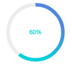

# 安装

## npm 安装

推荐使用 npm 的方式安装，它能更好地和 [webpack](https://webpack.js.org/) 打包工具配合使用。

``` shell
npm i --save peony-ui
```

## CDN

菜鸟玩家整不起

## Hello world

``` html
<template>
  <div class="hello-world">
    <peony-circle :size="120" :stroke-width="6" :trail-width="6" :percent="percent" :stroke-color="strokeColor" :trail-color="trailColor">
      <span style="color:#36D1DC">{{ percent }}%</span>
    </peony-circle>
    <button @click="add">+</button>
    <button @click="sub">-</button>
    <button @click="strokeColor = ['#36D1DC', '#5B86E5']">渐变</button>
    <button @click="strokeColor = '#36D1DC'">单一颜色</button>
    <button @click="trailColor = '#ececec'" style="color: #ececec">圆环背景 1</button>
    <button @click="trailColor = '#C0C4CC'" style="color: #C0C4CC">圆环背景 2</button>
  </div>
</template>

<script>
export default {
  data () {
    return {
      percent: 20,
      strokeColor: ['#36D1DC', '#5B86E5'],
      trailColor: '#ececec'
    }
  },
  methods: {
    add () {
      let percent = this.percent + 20
      if (percent < 100) {
        this.percent = percent
      } else {
        this.percent = 100
      }
    },
    sub () {
      let percent = this.percent - 20
      if (percent > 0) {
        this.percent = percent
      } else {
        this.percent = 0
      }
    }
  }
}
</script>
```

result


